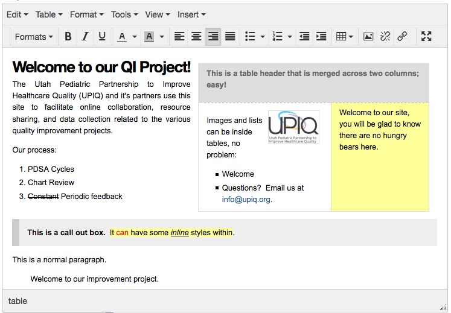

******************************************
Guide to Editing Rich Text in QI TeamSpace
******************************************

*This guide describes editing rich text content in QI TeamSpace,
using what we term a "visual editor" --
a tool that creates nice-looking, readable HTML
for your TeamSpace site and projects.*

About Rich text editing
=======================

What is rich text?
------------------

When we use the term rich text, we are differentiating from "plain text"
-- with rich text we can style text as follows:

* With bold, underline, and italic emphasis

* With headings of varying levels

* With bulleted and numbered lists

* With named styles for special behaviors

* With text and highlight colors.

* With inserted hyperlinks and images.

* With tables

* By pasting rich text from word processing applications.

TeamSpace integrates the TinyMCE 4 "visual editor"
that allows you to write rich text in a user experience
similar to a word processing environment.  
This editor creates HTML for you with a simple editing experience
without the necessity of knowing how to code HTML "markup".

--------------------------------

Where is rich text used in QI TeamSpace?
----------------------------------------

Rich text and the visual editor are used in QI TeamSpace when editing
or maintaining the following components of your site and projects:

* Page content

* Static text "portlets" used in the right or left columns of your site

* Some optional rich text fields in forms and reports:

    - Plot captions

    - Form instructions

    - Rich text fields in Flex forms

How is rich text edited?
------------------------

Rich text is edited in a "visual editor" component, usually on an edit form
for content or a component of the site
(such as a "static text portlet" or part of a data form).

Our visual editor is powered by a popular editing component called TinyMCE,
and TeamSpace has recently update to version 4.3,
which is a significant improvement over previous versions of TinyMCE
used on our QI TeamSpace sites.

The visual editor presents a menu and buttons
at the top of the editing widget that allow you to style and manipulate text.
With these buttons you can modify how your text is presented
or insert/edit links and images within your text.
You may also upload files to link to,
or images to embed in your text through the editor.

What does this look like?
-------------------------

**Notice the following elements in the image above:**

* A traditional drop-down menu; this helps prevent a situation
  where we have far too many buttons for editing operations.

    .. image:: ../../images/screenshots/tinymce-menu-bar.png

* A compact button bar, with simple buttons to:

    .. image:: ../../images/screenshots/tinymce-button-bar.png
  
  - Choose formats for selected text or paragraphs.

    .. image:: ../../images/screenshots/tinymce-formats-expanded.png

  - Buttons to change weight (bold), emphasis (italic, underline),
    foreground and background color of selected text.

    .. image:: ../../images/screenshots/tinymce-basic-styling-buttons.png

  - Buttons to change the justification of paragraphs in your text:

    .. image:: ../../images/screenshots/tinymce-justification-buttons.png

  - Buttons to insert bulleted or numbered lists of varying styles:

    .. image:: ../../images/screenshots/tinymce-bullet-list-button.png

  - A drop-down button for inserting and managing tables.

    .. image:: ../../images/screenshots/tinymce-table-button-expanded.png

  - Buttons to insert/edit images and hyperlinks:

    .. image:: ../../images/screenshots/tinymce-buttons-image-and-links.png

    - A button to insert/edit image details

      - When clicked without selection, a "insert image" box appears.

      - When clicked and an existing image is selected, you will see details
        for that image.

      - You can choose images from within the site (already uploaded),
        or link to images on other sites by URL.

          - **For convenience, this interface allows you to upload images.**

      - Tools for editing hyperlinks to:

        - Internal content items within your project

        - Internal page sections, headings, and anchors within a long page
        
          - *You can use anchor and link features to manually create*
            *a nice table of contents by linking to headings or anchors*
            *within a page containing significant amounts of content.*

        - External web pages that may be opened in same or new window

        - Email addresses ("mailto" links)

  - You may make the editing interface occupy the full window with the
    full-screen button.

    .. image:: ../../images/screenshots/tinymce-button-fullscreen.png

  - In the edited text example you may see:

    - Headings and normal paragraphs;

    - Styled text including bold, underline, colors;

    - Tables and lists;

    - An inserted image.

What are the limitations?
-------------------------

* **For styling text:**

  - You can choose named styles, but do not have the ability to choose font
    face or font size.
    
    - *In most cases, existing styles can handle your need and will*
      *make for more consistent presentation of text designed*
      *primarily for viewing on screen than choosing font face or size.*

    - You can however, choose from a variety of named text styles
      and choose text color, and background/highlight color for text.

    - Custom name styles per site may be created upon request.  Should you
      have custom needs for site-specific typography, please email us
      at partnersupport@upiq.org -- we will do our best to accommodate.

Styling Paragraphs and Inline Text
==================================

Definitions
-----------

* Paragraph styles: 

* Inline text styles:

Basics of styling paragraphs
----------------------------

